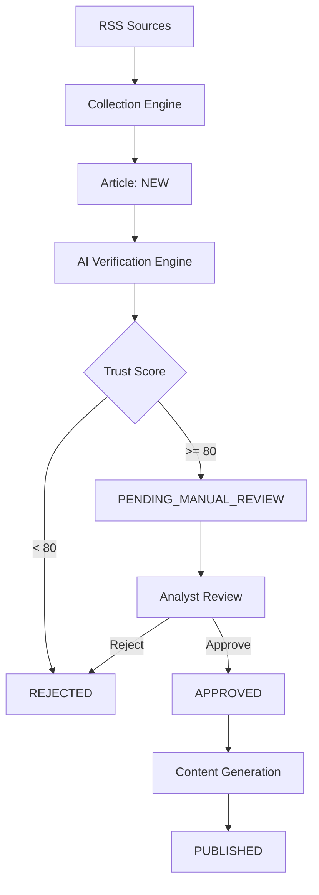

# System Architecture

## Overview

Security Intelligence follows **Clean Architecture** with a feature-based modular structure:

```
backend/app/
├── api/v1/          # HTTP routes (thin controllers)
├── core/            # Security, dependencies, exceptions
├── models/          # SQLAlchemy ORM entities
├── schemas/         # Pydantic request/response models
├── repositories/    # Data access layer
├── services/        # Business logic
└── workers/         # Background jobs (RSS collector)
```

## Intelligence Workflow



## Trust Score Model

| Signal | Points |
|--------|--------|
| Trusted source | 20 |
| Multiple confirmations | 20 |
| Official advisory | 25 |
| CVE found | 15 |
| CISA/NVD validation | 20 |
| **Maximum** | **100** |

Decision: score &lt; 80 → auto-reject; score ≥ 80 → manual review queue.

## Authentication & Authorization

- **JWT** bearer tokens issued at login
- **RBAC** enforced via FastAPI dependencies (`require_admin`, `require_analyst`)
- All mutating operations write to `audit_logs`

## External Integrations

| Integration | Purpose | MVP Status |
|-------------|---------|------------|
| RSS feeds | Intelligence collection | Live |
| OpenAI API | Verification & content generation | Configurable (heuristic fallback) |
| NVD API | CVE validation | Live lookup |
| LinkedIn/X/Facebook | Social publishing | Abstracted (internal publish only) |

## Frontend Architecture

```
frontend/src/
├── api/             # Axios API clients
├── components/      # Reusable UI (layout, auth, common)
├── hooks/           # useAuth, useNotification
├── pages/           # Route-level views
├── store/           # Redux (auth, notifications)
└── types/           # TypeScript interfaces
```

State management: Redux for auth/session, TanStack Query for server data.

## Background Processing

`CollectionWorker` (APScheduler) polls active RSS sources every 60 minutes. Manual collection is also available via the Sources UI and `/api/v1/collector/collect-all` endpoint.
