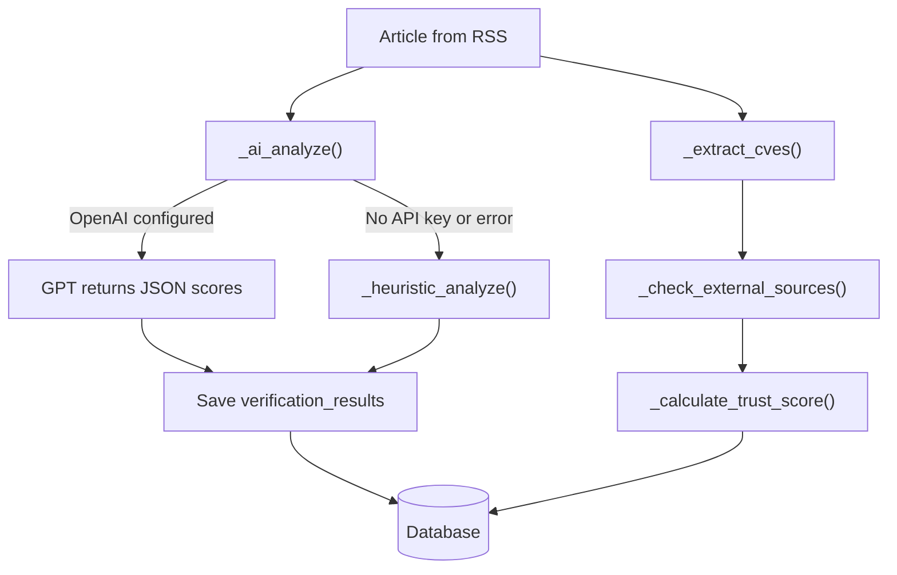
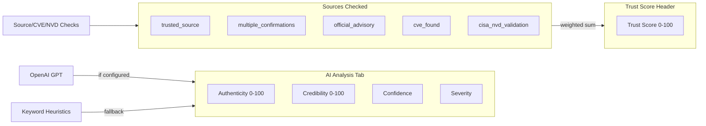

# EchoSafe Scoring System — How It Works (From the Code)

All scoring logic lives in one backend file:

[`EchoSafe/hackathon/security-copilot/backend/app/services/verification.py`](EchoSafe/hackathon/security-copilot/backend/app/services/verification.py)

The UI **does not calculate anything** — it only displays values returned by `GET /api/v1/articles/{id}` in [`IntelligenceDetail.tsx`](EchoSafe/hackathon/security-copilot/frontend/src/pages/Intelligence/IntelligenceDetail.tsx).

---

## When Scores Are Computed

Verification runs when an article is verified via:

- `POST /api/v1/articles/{id}/verify` (manual "Verify" button)
- Auto-verification after RSS collection (collector worker)

**Pipeline** (`verify_article()`):



---

## Part 1: AI Analysis Tab Metrics

These four fields come from the **same step** (`_ai_analyze`), but they use **two different methods** depending on configuration.

### Path A — AI Scoring (when `OPENAI_API_KEY` is set)

- Model: `gpt-4o-mini` (configurable via `OPENAI_MODEL`)
- Input: article title + first 3,000 chars of content/summary
- Output: JSON with `authenticity_score`, `credibility_score`, `severity`, `confidence`, plus narrative fields

The model is prompted to return:

| Field | Type | Meaning |
|-------|------|---------|
| `authenticity_score` | 0–100 | Likelihood the article is authentic |
| `credibility_score` | 0–100 | Credibility of the source/claims |
| `severity` | critical / high / medium / low / info | Threat severity |
| `confidence` | high / medium / low | How confident the assessment is |

If the API call fails, the system **falls back** to Path B.

### Path B — Heuristic Scoring (current state in your screenshot)

Your screenshot shows: *"AI analysis not configured - using heuristic scoring"*

This means **no OpenAI key** (or API failure). Scores are computed by **keyword counting** in title + content + summary:

**Keyword tiers:**

| Tier | Keywords (examples) |
|------|---------------------|
| Critical | `0-day`, `zero-day`, `critical`, `rce`, `ransomware`, `data breach`, `actively exploited` |
| High | `vulnerability`, `exploit`, `cve`, `patch`, `attack`, `malware`, `breach`, `compromise` |
| Medium | `security`, `threat`, `risk`, `advisory`, `update` |

**Scoring rules** (first matching rule wins):

| Condition | Authenticity | Credibility | Severity |
|-----------|-------------|-------------|----------|
| 2+ critical keywords | 75 | 70 | critical |
| 1 critical keyword | **65** | **60** | **high** |
| 2+ high keywords | 60 | 55 | high |
| 1 high keyword | 55 | 50 | medium |
| 1+ medium keywords (and none above) | 50 | 45 | low |
| No keywords matched | 50 | 50 | medium |

**Confidence** (heuristic only — derived from authenticity):

- `high` if authenticity >= 70
- `low` if authenticity < 50
- `medium` otherwise

### Your Screenshot Example Explained

Article: **"Anti-DDoS Firm Heaped Attacks on Brazilian ISPs"** (KrebsOnSecurity)

- Content likely contains 1 critical keyword (e.g. "attack") → **Authenticity 65, Credibility 60, Severity high, Confidence medium**
- This exactly matches the heuristic rule for `crit_count == 1`

---

## Part 2: Sources Checked (Separate from AI Scores)

These five boolean flags are **always computed heuristically** in `_check_external_sources()` — even when AI scoring is active. They do **not** affect Authenticity/Credibility directly; they feed the **Trust Score**.

| Flag | How "Found" is determined |
|------|---------------------------|
| **trusted_source** | RSS source name contains a known publisher substring (e.g. `krebs`, `cisa`, `bleepingcomputer`, `nist`, `mitre`, etc.) — see `TRUSTED_SOURCE_NAMES` list in code |
| **cve_found** | At least one CVE ID found via regex `CVE-YYYY-NNNN+` in title/content/summary |
| **official_advisory** | Title contains `"advisory"` or `"cve"`, OR source name contains a vendor name (Microsoft, Cisco, Google, etc.) |
| **multiple_confirmations** | Source type is `vendor_blog` or `threat_feed`, OR (`trusted_source` AND `cve_found` both true) |
| **cisa_nvd_validation** | Live HTTP call to NIST NVD API for the first CVE; `Found` if `totalResults > 0` |

### Your Screenshot Example — Sources Checked

| Flag | Result | Why |
|------|--------|-----|
| trusted_source | Found | Source is KrebsOnSecurity (`krebs` in `TRUSTED_SOURCE_NAMES`) |
| multiple_confirmations | Found | trusted_source + cve_found both true |
| official_advisory | Not found | Title has no "advisory"/"cve"; Krebs is not a vendor name |
| cve_found | Found | CVE-2023-1389 extracted from article text |
| cisa_nvd_validation | Found | NVD API confirmed CVE-2023-1389 exists |

---

## Part 3: Trust Score (Header — 75/100)

**Trust Score is a separate calculation** from Authenticity/Credibility. It is an **additive point system** capped at 100:

| Signal | Points if Found |
|--------|-----------------|
| trusted_source | +20 |
| multiple_confirmations | +20 |
| official_advisory | +25 |
| cve_found | +15 |
| cisa_nvd_validation | +20 |

**Formula:** `trust_score = min(100, sum of points for true flags)`

### Your Screenshot Example — Trust Score 75

```
trusted_source:          +20
multiple_confirmations:  +20
official_advisory:       + 0  (not found)
cve_found:               +15
cisa_nvd_validation:     +20
                         ----
Total:                    75
```

Only flags that are `true` appear in the **Trust Score breakdown chart** (tab 2). False flags are omitted, not shown as 0.

### Article Status Gate

After scoring, article status is set:

- `trust_score >= 20` → `pending_manual_review`
- `trust_score < 20` → `rejected`

---

## Architecture Summary for Your Manager



**Key talking points:**

1. **Two scoring engines, not one** — Content quality scores (Authenticity/Credibility/Confidence/Severity) come from AI or keyword heuristics. Trust Score comes from verifiable external signals (source reputation, CVE presence, NVD validation).

2. **Current deployment uses heuristics** — Without `OPENAI_API_KEY`, the "AI Analysis" tab still works but uses keyword matching. The UI message explicitly says this.

3. **Sources Checked are evidence flags, not scores** — They answer "what did we verify?" and directly drive Trust Score.

4. **NVD is the only live external API** — `cisa_nvd_validation` calls `https://services.nvd.nist.gov/rest/json/cves/2.0` in real time. Other checks are local heuristics (no CISA API call despite the name).

5. **Frontend is display-only** — All logic is backend; analysts trigger re-scoring via the Verify button.

---

## Code References

Orchestration:

```64:124:EchoSafe/hackathon/security-copilot/backend/app/services/verification.py
def verify_article(self, article_id: int) -> VerificationResult:
    # ...
    ai_data = self._ai_analyze(article)
    cves = self._extract_cves(combined_text)
    checks = self._check_external_sources(article, cves)
    trust_score, breakdown = self._calculate_trust_score(checks, cves)
```

Heuristic scoring table:

```201:228:EchoSafe/hackathon/security-copilot/backend/app/services/verification.py
if crit_count >= 2:
    authenticity_score = 75
    # ...
elif crit_count == 1:
    authenticity_score = 65
    credibility_score = 60
    severity = "high"
```

Trust score weights:

```331:342:EchoSafe/hackathon/security-copilot/backend/app/services/verification.py
if checks.get("trusted_source"):
    breakdown["trusted_source"] = 20
# ... +20, +25, +15, +20 for other flags
total = min(100, sum(breakdown.values()))
```

UI display (no calculation):

```371:374:EchoSafe/hackathon/security-copilot/frontend/src/pages/Intelligence/IntelligenceDetail.tsx
{ label: 'Authenticity Score', value: vr.authenticity_score, ... },
{ label: 'Credibility Score', value: vr.credibility_score, ... },
{ label: 'Confidence', value: vr.confidence ?? 'N/A', ... },
{ label: 'Severity', value: vr.severity ?? 'N/A', ... },
```

---

## Optional Enhancement (Not in Scope Unless Requested)

To switch from heuristic to real AI scoring: set `OPENAI_API_KEY` in the Security Copilot backend environment. Authenticity/Credibility/Confidence/Severity would then come from GPT; Sources Checked and Trust Score logic would remain unchanged.
